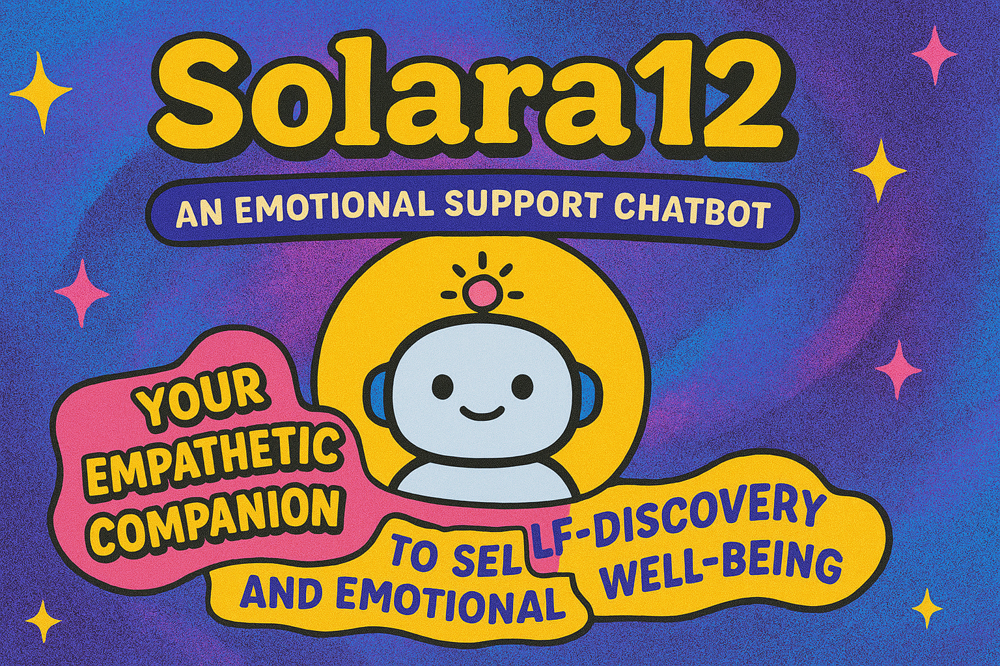

# 🌞 Solara - AI Conversational Companion

<div align="center">
  
  
  **Your Empathetic AI Companion for Emotional Intelligence & Self-Discovery**
  
  [](https://python.org)
  [](https://streamlit.io)
  [](https://langchain.com)
  [](https://ollama.ai)
</div>

---

## 🎯 Overview

Solara is an advanced conversational AI application that combines emotional intelligence with sophisticated context engineering. Built for meaningful conversations, self-discovery, and emotional support.

## 🛠️ Tech Stack

| Component | Technology | Purpose |
|-----------|------------|---------|
| **Frontend** | Streamlit | Interactive web interface with custom styling |
| **LLM Integration** | LangChain + Ollama | Local AI model management and conversation handling |
| **AI Model** | Mistral 7B | Core conversational AI capabilities |
| **Visualization** | Plotly | Interactive charts for emotion tracking |
| **Data Processing** | Pandas, NumPy | Context analysis and pattern recognition |
| **Styling** | Custom CSS | Modern UI with gradients and animations |

## ✨ Core Features

### 🧠 **Advanced Context Engineering**
- **Dynamic Memory Management**: Maintains conversation context across sessions
- **Emotion Recognition**: Automatically detects and tracks 8+ emotion categories
- **Topic Extraction**: Identifies discussion themes (work, relationships, health, etc.)
- **Contextual Prompting**: Enhances AI responses with conversation history

### 💝 **Empathetic AI Personality**
- **Adaptive Communication**: 3 communication styles (Gentle/Balanced/Direct)
- **Emotional Intelligence**: Responds appropriately to user's emotional state
- **Thoughtful Insights**: Provides meaningful perspectives for self-discovery
- **Validation & Support**: Acknowledges feelings with genuine empathy

### 🎨 **Modern User Interface**
- **Beautiful Design**: Gradient backgrounds, smooth animations, custom components
- **Responsive Layout**: Optimized for desktop and mobile devices
- **Interactive Sidebar**: User profile, mood tracking, session controls
- **Visual Analytics**: Emotion timelines, topic clouds, conversation metrics

### 📊 **Smart Analytics**
- **Emotion Tracking**: Visual representation of emotional journey
- **Conversation Insights**: Topic distribution and interaction statistics  
- **Export Functionality**: Download chat history for reflection
- **Progress Visualization**: Charts showing emotional patterns over time

## 🚀 Quick Start

### Prerequisites
```bash
# Required software
Python 3.8+
Ollama (with Mistral model)
```

### Installation
```bash
# 1. Clone/download project files
mkdir solara-ai && cd solara-ai

# 2. Install dependencies
pip install -r requirements.txt

# 3. Setup Ollama
ollama pull mistral

# 4. Run application
python run.py

# 5. Open browser
# Navigate to http://localhost:8501
```

## 📁 Project Structure

```
solara-ai/
├── 📱 app.py              # Main Streamlit application
├── 🧠 context_engine.py   # Context management & emotion tracking
├── 💝 personality.py      # AI personality & response patterns
├── 🎨 ui_components.py    # Custom UI components & styling
├── ⚙️ config.py           # Configuration management
├── 🚀 run.py              # Application runner
├── 📦 requirements.txt    # Dependencies
├── 📖 README.md           # Documentation
└── 🖼️ sol.png            # Application logo
```

## 🎯 Key Features Deep Dive

### Context Engineering System
```python
# Automatic emotion detection from 8 categories
emotions = ["joy", "sadness", "anger", "fear", "surprise", "trust", "anticipation", "disgust"]

# Topic extraction patterns
topics = ["work_career", "relationships", "health", "finances", "mental_health", "future_planning"]

# Dynamic context building
enhanced_prompt = f"[User: {name}] [Mood: {mood}] [Recent Emotions: {emotions}] {user_input}"
```

### Personality Adaptation
```python
# Personality traits (1-10 scale)
traits = {
    "empathy": 9,      # High emotional understanding
    "insight": 8,      # Thoughtful perspectives  
    "warmth": 9,       # Caring communication
    "patience": 10,    # Never rushed responses
    "authenticity": 8  # Genuine interactions
}
```

### UI Components
- **Metric Cards**: Show conversation statistics
- **Emotion Tags**: Visual emotion indicators
- **Topic Clouds**: Interactive discussion themes
- **Custom Chat Bubbles**: Styled message containers
- **Analytics Charts**: Plotly-powered visualizations

## 🔧 Configuration

### Communication Styles
- **Gentle**: Extra soft language, maximum emotional support
- **Balanced**: Mix of empathy and practical insights  
- **Direct**: Solution-focused while maintaining warmth

### Model Settings
```python
DEFAULT_MODEL = "mistral"
TEMPERATURE = 0.7
MAX_TOKENS = 2048
CONTEXT_WINDOW = 20
```

### Feature Toggles
```python
ENABLE_EMOTION_TRACKING = True
ENABLE_TOPIC_EXTRACTION = True  
ENABLE_ANALYTICS = True
ENABLE_EXPORT = True
```

## 💡 Usage Examples

### Starting Conversations
```
"I've been feeling overwhelmed with work lately..."
"I'm excited about a new opportunity but also scared..."
"I had a difficult conversation with someone I care about..."
```

### Analytics Features
- View emotional journey over time
- Track discussion topics
- Export conversations for reflection
- Monitor interaction patterns

## 🛠️ Development

### Running Different Modes
```bash
# Development mode (debug logging)
python run.py --env development

# Production mode (optimized)
python run.py --env production

# Custom port/host
python run.py --port 8080 --host 0.0.0.0

# System check only
python run.py --check-only
```

### Extending Features
- **New Emotions**: Add to `emotion_keywords` in `context_engine.py`
- **Custom UI**: Modify components in `ui_components.py`
- **Personality Traits**: Extend traits in `personality.py`
- **Analytics**: Add charts in UI components

## 🔍 Troubleshooting

| Issue | Solution |
|-------|----------|
| LLM initialization fails | Verify Ollama is running: `ollama serve` |
| Missing dependencies | Run: `pip install -r requirements.txt` |
| UI styling broken | Clear browser cache or try incognito mode |
| Memory issues | Reduce `MAX_MESSAGE_HISTORY` in config |

## 🌟 What Makes Solara Special

1. **Local AI**: Complete privacy with local Ollama models
2. **Emotional Intelligence**: Advanced emotion recognition and appropriate responses
3. **Context Awareness**: Maintains meaningful conversation flow
4. **Beautiful UI**: Professional design with smooth animations
5. **Personality Adaptation**: Adjusts to user preferences and emotional state
6. **Analytics**: Insights into emotional patterns and conversation themes
7. **Export Features**: Save conversations for personal reflection

## 📊 Performance Metrics

- **Response Time**: < 2 seconds (local processing)
- **Context Window**: 20 messages with intelligent pruning
- **Emotion Categories**: 8 primary emotions tracked
- **Topic Categories**: 7 life areas automatically identified
- **Memory Efficiency**: Dynamic context management prevents memory bloat

## 🤝 Contributing

Feel free to enhance Solara by:
- Adding new emotion recognition patterns
- Creating custom UI themes
- Implementing additional personality traits
- Building new analytics features
- Expanding topic extraction capabilities

## 📄 License

Open source project for educational and personal use.

---

<div align="center">
  <strong>🌞 Welcome to Solara - Where every conversation lights the way to self-discovery! ✨</strong>
  
  Built with ❤️ using Streamlit, LangChain & Ollama
</div>
